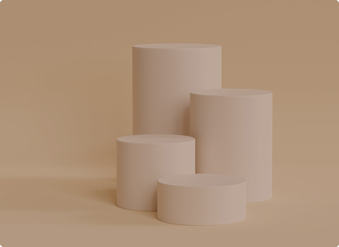

# GroupWork-6

    

      

        

          
          
          
        

        

          
        

      

    

    .related-projects{
  .container{
    display: flex;
    column-gap: 30px;
    .left{
      width: 570px;
      height: 416px;
      position: relative;
      .left-image{
        width: 100%;
      }
      .sofa{
        position: absolute;
        bottom: 51px;
        left: 48px;
      }
      .tag{
        position: absolute;
        left: 48px;
        bottom: 122px;
      }
    }
    .right{
      width: 570px;
      height: 416px;
      
    }
  }
}

position: absolute;
             bottom: 30px;
             left: 24px;
             transform: translate(10%, 5%);
             margin-right: 70%;
             margin-top: 70%;
           }
           .tag{
               position: absolute;
                 left: 35px;
                 bottom: 80px;
                 margin-right: 60%;
                 margin-top: 60%;
           }
           img {
             width: 100%;
            
           }
         }

         .right {
           img {
             width: 100%;
           }